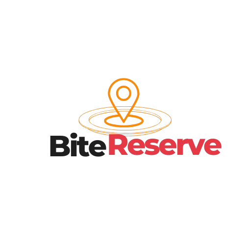

<p align="center">
  
</p>

<h1 align="center">Bite Reserve</h1>

<p align="center">
  Restaurant Management Platform
</p>

<p align="center">
  <a href="bitereserve.netlify.app">Live Demo</a>
</p>

---

## 📖 Overview

Bite Reserve is a full-stack restaurant management platform that enables customers to browse menus, place food orders, reserve tables, and track their order status in real time. It also provides administrators with a dedicated dashboard to efficiently manage orders, reservations, and restaurant operations.

---

## ✨ Features

- User authentication
- Browse restaurant menu
- Online food ordering
- Table reservation system
- Real-time order tracking
- Admin dashboard
- Order status management
- Firebase Firestore integration
- Responsive design
- Modern user interface

---

## 🎯 Problem

The restaurant relied on manual communication for handling food orders and table reservations, making it difficult to organize requests, track order progress, and keep customers updated.

---

## 💡 Solution

Developed a responsive restaurant management platform using React and Firebase that allows customers to order food, reserve tables, and monitor their orders in real time. Administrators can manage incoming orders through a dedicated dashboard and update each order's status from **Pending → Preparing → Completed**.

---

## 🚀 Result

Delivered a modern digital ordering experience with real-time synchronization, streamlined restaurant operations, and a faster workflow for both customers and restaurant staff.

---

## 🛠 Tech Stack

- React
- Vite
- Tailwind CSS
- Firebase
- Firestore
- Firebase Authentication
- Lucide React

---

## 📚 Engineering Insights

- Designing and building a complete CRUD application with Firebase
- Managing real-time restaurant data using Firestore
- Implementing role-based features for customers and administrators
- Building order lifecycle management from Pending to Preparing to Completed
- Creating reusable React components for scalable development
- Designing responsive interfaces focused on usability across devices

---

## 📂 Folder Structure

```text
Bite-Reserve/
│
├── public/
│
├── src/
│   ├── assets/
│   ├── components/
│   ├── context/
│   ├── firebase/
│   ├── hooks/
│   ├── layouts/
│   ├── pages/
│   ├── routes/
│   ├── utils/
│   ├── App.jsx
│   ├── main.jsx
│   └── index.css
│
├── package.json
├── vite.config.js
└── README.md
```

---

## ⚙️ Installation

Clone the repository

```bash
git clone https://github.com/maheenfarooqui/Bite-Reserve
```

Install dependencies

```bash
npm install
```

Run the development server

```bash
npm run dev
```

Create a production build

```bash
npm run build
```

---

## 🌐 Live Demo

YOUR_LIVE_DEMO_LINK

---

## 👩‍💻 Author

**Maheen Zuhra**

Frontend Developer

- Portfolio: https://maheen-zuhra-portfolio.vercel.app/
- LinkedIn: https://www.linkedin.com/in/maheen-zuhra/
